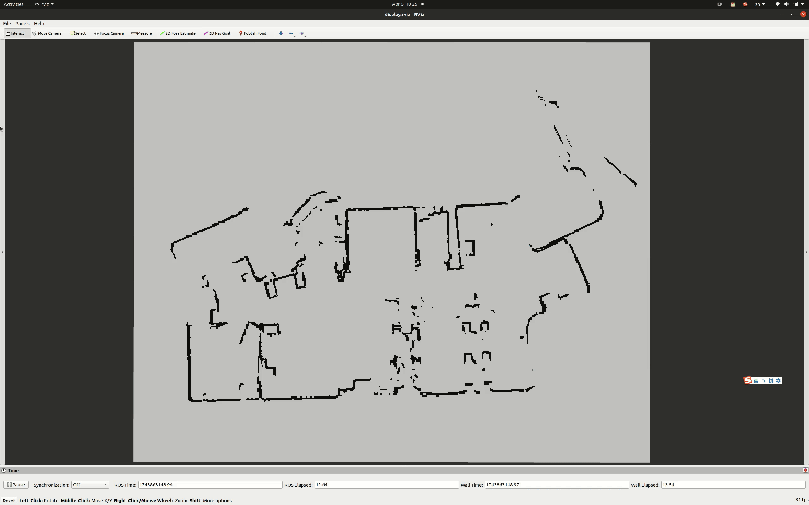

# FlowCore​​
A GlobalPlanner Based on Minco Curve

* Obstacle avoidance within safe corridor
* Satisfy curvature constraints (kappa)

## Updates
* April 5,2025
  
## Dependencies
* Eigen3
* ompl 1.6.0

## Examples

## Reference
> [1] Z. Wang, X. Zhou, C. Xu and F. Gao, "Geometrically Constrained Trajectory Optimization for Multicopters," in IEEE Transactions on Robotics, vol. 38, no. 5, pp. 3259-3278, Oct. 2022, doi: 10.1109/TRO.2022.3160022.
> 
> [2] Z. Han et al., "An Efficient Spatial-Temporal Trajectory Planner for Autonomous Vehicles in Unstructured Environments," in IEEE Transactions on Intelligent Transportation Systems, vol. 25, no. 2, pp. 1797-1814, Feb. 2024, doi: 10.1109/TITS.2023.3315320.
> 
> [3] S. Liu, M. Watterson, K. Mohta, K. Sun, S. Bhattacharya, C.J. Taylor and V. Kumar. Planning Dynamically Feasible Trajectories for Quadrotors using Safe Flight Corridors in 3-D Complex Environments. ICRA 2017.
